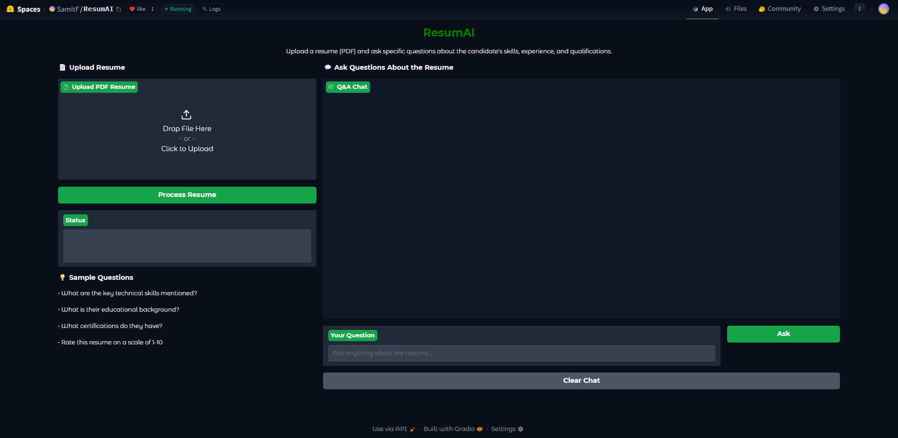
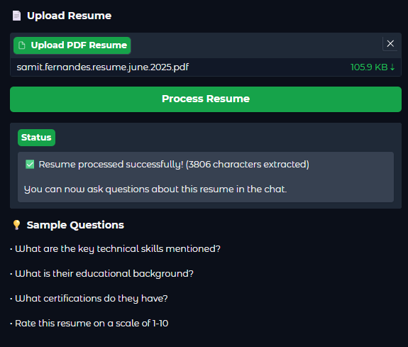
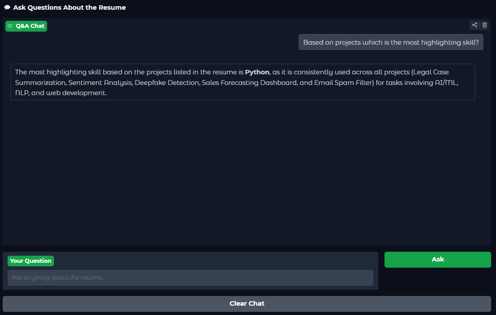
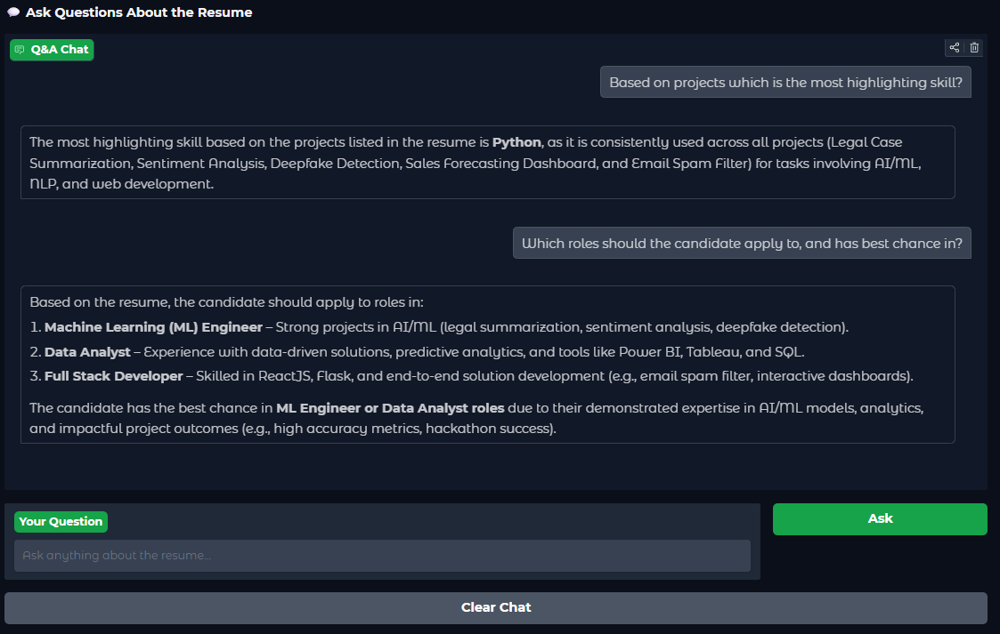

# ResumAI
ResumAI is an AI-powered resume assistant that lets you upload a PDF resume and ask questions about it. The ResumAI bot, provides smart, concise answers based on the resume content — perfect for recruiters, students, or anyone analyzing resumes.

---

## 📸 Preview

### 🧾 1. Upload the Resume

### ⌛ 2. Resume Uploaded Sucessfully

### 🔤 3. Input Question

### 💡 4. Get Tailored Answers

### ✅ 5. Get To Know More...

